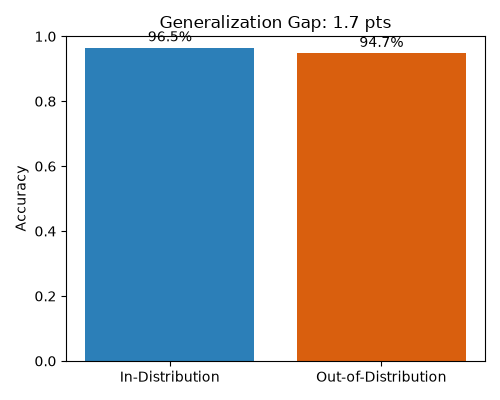

# Fetal Ultrasound Plane Classification: A Cross-Domain Generalization Study

A small exploratory project applying deep learning to fetal ultrasound image
classification, with a specific focus on measuring how well a model
generalizes across different ultrasound machines and operators. This project
is a hands-on precursor to my proposed Masters thesis on cross-domain
generalization in deep learning-based fetal ultrasound image quality
assessment.

## Motivation

Most deep learning models for fetal ultrasound are trained and evaluated on
data from a single hospital or machine, and often perform worse when applied
to images from a different device, operator, or clinical setting. This
project is a small-scale, hands-on test of that idea: train a classifier on
one subset of a public dataset, then explicitly measure how much accuracy
drops when evaluating on a held-out subset that differs by acquisition
machine or operator.

This is **not** a full research contribution — it's a scoped learning
project to build practical deep learning experience directly relevant to my
proposed thesis direction, and to demonstrate the generalization-gap
methodology at small scale before applying it more rigorously in a Masters
program.

## Dataset

This project uses the **FETAL_PLANES_DB** dataset (Burgos-Artizzu et al.,
2020), a public dataset of 12,400 fetal ultrasound images from 1,792
patients, collected at two hospitals in Barcelona using multiple ultrasound
machines and operators.

- Source: https://zenodo.org/record/3904280
- The dataset includes a CSV of metadata (`FETAL_PLANES_DB_data.csv`) with
  columns including `Image_name`, `Patient_num`, `Plane` (the anatomical
  plane label), `US_Machine`, `Operator`, and a provided `Train` split.

**Setup:** download the dataset from Zenodo, unzip the images into
`data/Images/`, and place the CSV at `data/FETAL_PLANES_DB_data.csv`. See
`data/README.md` for exact expected structure.

I have not redistributed the dataset itself in this repository — only code
that operates on it — in line with the original dataset's terms of use.

## Method

1. **Task:** multi-class classification of the ultrasound `Plane` (e.g.
   abdomen, brain, femur, thorax, other).
2. **Model:** a ResNet18 backbone (pretrained on ImageNet), fine-tuned on
   fetal ultrasound images. A simple CNN baseline is also included for
   comparison.
3. **Generalization evaluation (the core idea of this project):**
   - **In-distribution (ID) test set:** held-out images from the *same*
     `US_Machine` values seen during training.
   - **Out-of-distribution (OOD) test set:** held-out images from a
     `US_Machine` (or `Operator`) *not* seen during training.
   - I report accuracy on both and compute the **generalization gap**
     (ID accuracy − OOD accuracy) as the key metric of interest, rather
     than just overall accuracy.

This ID/OOD split design is a small-scale version of the evaluation
approach used in published work on fetal ultrasound generalization to
low-resource settings, and is the same core question I plan to explore in
more depth in my Masters thesis.

## Project structure

```
fetal-us-quality-gen/
├── README.md
├── requirements.txt
├── .gitignore
├── data/
│   └── README.md          # dataset download/setup instructions
├── src/
│   ├── dataset.py          # PyTorch Dataset + ID/OOD split logic
│   ├── model.py             # ResNet18 and simple CNN baseline
│   ├── train.py              # training loop
│   ├── evaluate.py           # ID vs OOD evaluation + generalization gap
│   └── utils.py               # seeding, transforms, plotting helpers
└── results/                # training logs, saved plots (populated after running)
```

## How to run

```bash
pip install -r requirements.txt

# Train
python src/train.py --data_dir data/ --epochs 15 --model resnet18

# Evaluate ID vs OOD generalization gap
python src/evaluate.py --data_dir data/ --checkpoint results/best_model.pt
```

## Results

Training was run for 15 epochs on a ResNet18 backbone, holding out one
ultrasound machine entirely as the out-of-distribution (OOD) test set.

| Metric | Accuracy |
|---|---|
| Training (final epoch) | 99.3% |
| In-distribution validation (best) | 96.5% |
| Out-of-distribution (held-out machine) | 94.7% |
| **Generalization gap** | **1.7 points** |



The generalization gap for this held-out machine was modest, suggesting
the model's learned features transfer reasonably well across at least this
domain shift. However, overall accuracy can mask per-class differences —
some classes (e.g. "Other") showed noticeably weaker precision than the
overall accuracy suggests, indicating that specific anatomical categories
may be more vulnerable to domain shift than others even when aggregate
accuracy looks strong.

This result is a useful but limited signal: FETAL_PLANES_DB was collected
across only two hospitals, so the diversity of machines/settings is
narrower than a true cross-country domain shift (e.g. testing on real
low-resource clinical data). A small gap here does not rule out much
larger generalization failures under more extreme distribution shifts,
which is the open question I aim to investigate further in my proposed thesis.

## Limitations

- Single public dataset from one geographic region (Spain); the real
  motivation for my thesis — generalization to genuinely low-resource
  settings such as Bangladesh — would need real out-of-region clinical
  data, which this project does not include.
- Small-scale, single-run experiments; no hyperparameter search or
  statistical significance testing.
- This is a learning/demonstration project, not a claimed research
  contribution.

## Why this project

In many low-resource clinical settings, only one expert doctor may be available to review ultrasound scans, so pregnant women often face long waits outside the ultrasound room, and image quality issues sometimes lead to inaccurate or inconclusive results. This motivates my interest in AI tools that could help make fetal ultrasound image quality assessment more consistent and accessible in settings where specialist availability is limited.

## References

Burgos-Artizzu, X.P., Coronado-Gutiérrez, D., Valenzuela-Alcaraz, B. et al.
Evaluation of deep convolutional neural networks for automatic
classification of common maternal fetal ultrasound planes. *Sci Rep* 10,
10200 (2020).
